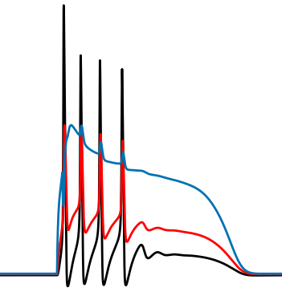

 

  

# bac

Exploring BAC firing through biophysical modelling.

## Acknowledgments

Many thanks to Nassi Papoutsi and Spyros Chavlis (https://dendrites.gr/) whose ["Principles of Computational Modeling in Neural Circuits" course material](https://github.com/spirosChv/neuro208) formed the basis for this project.

## References

1. **London M, Häusser M.** (2005) Dendritic computation. Annu Rev Neurosci. 28:503-32. doi: [10.1146/annurev.neuro.28.061604.135703](https://doi.org/10.1146/annurev.neuro.28.061604.135703)
2.  **Larkum, M.** (2013). A cellular mechanism for cortical associations: an organizing principle for the cerebral cortex. Trends in neurosciences, 36(3), 141-151. doi: [10.1016/j.tins.2012.11.006](https://doi.org/10.1016/j.tins.2012.11.006)
